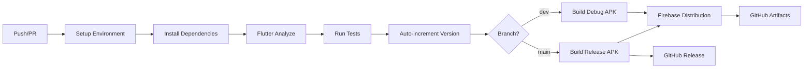

# 🚀 Workflow Flutter CI/CD - My Trainers

## ✨ Fonctionnalités

✅ **Auto-increment automatique** avec `${{ github.run_number }}`  
✅ **Firebase App Distribution** vers le groupe `testers`  
✅ **Build différencié** : Release (main) / Debug (dev)  
✅ **Tests automatiques** avec couverture de code  
✅ **Analyse statique** avec `flutter analyze`  
✅ **GitHub Release** automatique (production)  
✅ **Artifacts backup** (30 jours de rétention)  

## 🎯 Triggers

| Trigger | Branches | Conditions |
|---------|----------|------------|
| **Push** | `dev`, `main` | Changements dans `flutter/` |
| **Pull Request** | Toutes | Changements dans `flutter/` |

## 🏗️ Build Matrix

| Branche | Build Mode | APK | Firebase | GitHub Release |
|---------|-----------|-----|----------|----------------|
| `main` | `release` | ✅ | ✅ | ✅ |
| `dev` | `debug` | ✅ | ✅ | ❌ |

## 🔢 Auto-increment

```bash
# Avant build
version: 1.0.0+1

# Après auto-increment avec run_number=42
version: 1.0.0+42
```

La version est automatiquement mise à jour dans `pubspec.yaml` avant chaque build.

## 🔥 Firebase App Distribution

### Configuration

- **App ID**: `1:782316914398:android:5085370e3927209e23244f`
- **Projet Firebase**: `my-trainers-e7c26`
- **Groupe**: `testers`
- **Secret requis**: `FIREBASE_SERVICE_ACCOUNT`

### Release Notes

Les notes de version incluent automatiquement :
- Numéro de build
- Environnement (prod/dev)
- Version complète
- Branche et commit
- URL du backend API

## 🌍 Variables d'environnement

| Variable | Valeur |
|----------|---------|
| `API_BASE_URL` | `http://192.168.10.63:8000` |
| `ENV` | `prod` (main) / `dev` (autres) |
| `FLUTTER_VERSION` | `stable` |
| `JAVA_VERSION` | `17` |

## 📦 Artifacts

### Noms des artifacts

- **Production**: `my-trainers-prod-build-{run_number}`
- **Développement**: `my-trainers-dev-build-{run_number}`

### Rétention

- **GitHub Artifacts**: 30 jours
- **GitHub Releases**: Permanent (main uniquement)

## 🔧 Configuration requise

### Secrets GitHub

```bash
FIREBASE_SERVICE_ACCOUNT
```

**Format**: JSON complet du compte de service Firebase

### Structure du repository

```
my-trainers/
├── .github/
│   └── workflows/
│       └── flutter-ci.yml
└── flutter/
    ├── pubspec.yaml
    ├── lib/
    └── test/
```

## 🚦 Pipeline de déploiement



## 🐛 Debugging

### Tests en échec
```bash
# Local test
cd flutter
flutter test --coverage
```

### Build en échec
```bash
# Local build debug
cd flutter
flutter build apk --debug

# Local build release
cd flutter
flutter build apk --release
```

### Firebase upload en échec
1. Vérifier le secret `FIREBASE_SERVICE_ACCOUNT`
2. Vérifier l'App ID Firebase
3. Vérifier les permissions du compte de service

## 📈 Monitoring

- **GitHub Actions**: Logs détaillés pour chaque étape
- **Build Summary**: Résumé automatique avec métriques
- **Artifacts**: APK sauvegardés pour debug
- **Coverage**: Rapport de couverture de tests

## 🔄 Mise à jour

Pour modifier le workflow :

1. Éditer `.github/workflows/flutter-ci.yml`
2. Commit sur `dev` pour tester
3. Merge vers `main` pour production

---

**✨ Le workflow est maintenant prêt !** Chaque push déclenche automatiquement le build et la distribution Firebase.