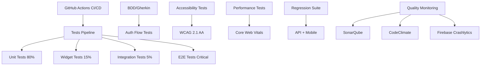

# Stratégie QA MyCoach v2.0 - Complète

## 🎯 Vue d'ensemble

**Mission :** Garantir la qualité end-to-end de MyCoach avec une approche automatisée, intégrée au CI/CD et un monitoring continu de la qualité.

**Périmètre :**
- Tests BDD/Gherkin pour auth flow (Coach vs Client)
- Tests de régression automatisés sur API + mobile
- Tests d'accessibilité (a11y) et performance mobile
- Framework tests end-to-end intégré au CI/CD
- Plan QA continue par sprint/release
- Outils de monitoring qualité en continu

---

## 🏗️ Architecture QA Complète

### Stack Technique Étendue



### Outils et Frameworks

| Catégorie | Outil | Usage |
|-----------|-------|--------|
| **BDD/Gherkin** | `gherkin` + `bdd_widget_test` | Scenarios auth flow |
| **Tests E2E** | `integration_test` + `patrol` | User journeys complets |
| **Accessibilité** | `flutter_accessibility` + `axe-core` | Tests a11y WCAG 2.1 |
| **Performance** | `flutter_driver` + lighthouse | Core Web Vitals mobile |
| **API Testing** | `dio_test` + `http_mock_adapter` | Contrats FastAPI |
| **Regression** | Détection automatique de drift | Golden tests + snapshots |
| **CI/CD** | GitHub Actions + workflow matrices | Pipelines automatisés |
| **Monitoring** | SonarQube + Firebase + DataDog | Qualité continue |

---

## 🔐 Tests BDD/Gherkin - Auth Flow

### Structure des Features

```
qa/features/auth/
├── coach_authentication.feature
├── client_authentication.feature
├── role_based_access.feature
└── password_recovery.feature
```

### Feature: Authentication Coach vs Client

```gherkin
Feature: Différentiation des rôles d'authentification
  En tant qu'utilisateur de MyCoach
  Je veux me connecter selon mon rôle (Coach ou Client)
  Pour accéder aux fonctionnalités adaptées à mon profil

  Background:
    Given l'application MyCoach est lancée
    And l'API backend est accessible

  Scenario: Inscription réussie d'un coach
    Given je suis sur l'écran d'inscription
    When je sélectionne le rôle "Coach"
    And je remplis les champs obligatoires:
      | email     | john.doe.coach@example.com |
      | password  | SecurePass123!             |
      | nom       | John Doe                   |
      | spécialité| Fitness                    |
    And je valide l'inscription
    Then je reçois un token d'authentification valide
    And je suis redirigé vers l'écran de configuration coach
    And mon profil contient le rôle "COACH"

  Scenario: Connexion réussie d'un client
    Given un client existe avec l'email "alice.client@example.com"
    And je suis sur l'écran de connexion
    When je sélectionne le rôle "Client"
    And je saisis:
      | email    | alice.client@example.com |
      | password | ClientPass123!           |
    And je clique sur "Se connecter"
    Then je suis connecté avec le rôle "CLIENT"
    And je suis redirigé vers l'écran de recherche coach
    And j'ai accès aux fonctionnalités client uniquement

  Scenario: Tentative de connexion avec mauvais rôle
    Given un coach existe avec l'email "coach@example.com"
    And je suis sur l'écran de connexion
    When je sélectionne le rôle "Client"
    And je saisis les identifiants du coach
    And je clique sur "Se connecter"
    Then je vois le message d'erreur "Rôle incorrect pour cet utilisateur"
    And je reste sur l'écran de connexion

  Scenario: Accès refusé aux fonctionnalités réservées aux coaches
    Given je suis connecté en tant que client
    When j'essaie d'accéder à "/coach/dashboard" 
    Then je vois le message "Accès non autorisé"
    And je suis redirigé vers l'écran client
```

---

## 🔄 Tests de Régression Automatisés

### Détection Automatique de Régressions

#### 1. API Regression Testing

```yaml
# test/regression/api_regression.yaml
api_baseline: "v1.0.0"
endpoints:
  - path: "/api/v1/auth/login"
    method: POST
    baseline_response: "fixtures/auth_login_v1.json"
    performance_threshold: 500ms
    
  - path: "/api/v1/coaches"
    method: GET
    baseline_response: "fixtures/coaches_list_v1.json"
    performance_threshold: 800ms

automated_checks:
  - response_schema_compatibility
  - performance_degradation
  - breaking_changes_detection
```

#### 2. Mobile UI Regression (Golden Tests Avancés)

```dart
// test/regression/golden_regression_test.dart
import 'package:flutter_test/flutter_test.dart';
import 'package:golden_toolkit/golden_toolkit.dart';

void main() {
  group('UI Regression Tests', () {
    testGoldens('Auth flow screens regression', (tester) async {
      await loadAppFonts();
      
      final scenarios = [
        ('login_coach', LoginScreen(userRole: UserRole.coach)),
        ('login_client', LoginScreen(userRole: UserRole.client)),
        ('signup_form', SignupScreen()),
      ];

      for (final scenario in scenarios) {
        await tester.pumpWidgetBuilder(
          scenario.$2,
          surfaceSize: const Size(375, 812), // iPhone 13 size
        );
        
        await screenMatchesGolden(tester, '${scenario.$1}_iphone13');
        
        // Test dark mode
        await tester.pumpWidgetBuilder(
          Theme(
            data: ThemeData.dark(),
            child: scenario.$2,
          ),
        );
        
        await screenMatchesGolden(tester, '${scenario.$1}_iphone13_dark');
      }
    });
  });
}
```

---

## ♿ Tests d'Accessibilité (a11y)

### WCAG 2.1 AA Compliance

```dart
// test/a11y/accessibility_test.dart
import 'package:flutter/semantics.dart';
import 'package:flutter_test/flutter_test.dart';

void main() {
  group('Accessibility Tests', () {
    testWidgets('Login form accessibility compliance', (tester) async {
      await tester.pumpWidget(MyApp());
      
      // Enable semantics for testing
      final SemanticsHandle handle = tester.ensureSemantics();
      
      await tester.pumpAndSettle();
      await tester.tap(find.byKey(Key('login_button')));
      await tester.pumpAndSettle();
      
      // Test 1: All interactive elements have semantic labels
      final emailField = find.byKey(Key('email_field'));
      expect(
        tester.getSemantics(emailField),
        matchesSemantics(
          label: 'Adresse email',
          hint: 'Saisissez votre adresse email',
          textDirection: TextDirection.ltr,
        ),
      );
      
      // Test 2: Contrast ratios meet WCAG AA standards
      final submitButton = find.byKey(Key('submit_button'));
      final button = tester.widget<ElevatedButton>(submitButton);
      final contrast = _calculateContrastRatio(
        button.style?.backgroundColor?.resolve({}) ?? Colors.blue,
        button.style?.foregroundColor?.resolve({}) ?? Colors.white,
      );
      expect(contrast, greaterThanOrEqualTo(4.5)); // WCAG AA requirement
      
      // Test 3: Touch targets meet minimum size (44x44 logical pixels)
      final buttonRenderBox = tester.renderObject<RenderBox>(submitButton);
      expect(buttonRenderBox.size.width, greaterThanOrEqualTo(44));
      expect(buttonRenderBox.size.height, greaterThanOrEqualTo(44));
      
      // Test 4: Screen reader navigation order
      final semantics = tester.getSemantics(find.byType(LoginScreen));
      final children = semantics.getSemanticsData().children;
      expect(children.first.label, contains('Email')); // First focusable element
      
      handle.dispose();
    });
  });
}

double _calculateContrastRatio(Color background, Color foreground) {
  // Implementation of WCAG contrast ratio calculation
  // Returns ratio between 1.0 and 21.0
  final bgLuminance = _luminance(background);
  final fgLuminance = _luminance(foreground);
  final lighter = math.max(bgLuminance, fgLuminance);
  final darker = math.min(bgLuminance, fgLuminance);
  return (lighter + 0.05) / (darker + 0.05);
}
```

---

## ⚡ Tests de Performance Mobile

### Core Web Vitals pour Mobile

```dart
// test/performance/mobile_performance_test.dart
import 'package:flutter_driver/flutter_driver.dart';

void main() {
  group('Mobile Performance Tests', () {
    FlutterDriver? driver;

    setUpAll(() async {
      driver = await FlutterDriver.connect();
    });

    tearDownAll(() async {
      await driver?.close();
    });

    test('Login flow performance metrics', () async {
      final timeline = await driver!.traceAction(() async {
        // Measure cold start
        await driver!.tap(find.byValueKey('app_start'));
        await driver!.waitFor(find.byValueKey('login_screen'));
        
        // Measure login form interaction
        await driver!.tap(find.byValueKey('email_field'));
        await driver!.enterText('test@example.com');
        await driver!.tap(find.byValueKey('password_field'));
        await driver!.enterText('password');
        
        // Measure login submission
        await driver!.tap(find.byValueKey('submit_button'));
        await driver!.waitFor(find.byValueKey('dashboard_screen'));
      });

      // Analyze timeline data
      final summary = TimelineSummary.summarize(timeline);
      
      // Core Web Vitals for mobile
      expect(summary.countFrames(), lessThan(120)); // Max 2s at 60fps
      expect(summary.computeAverageFrameBuildTimeMillis(), lessThan(16)); // 60fps target
      expect(summary.computeMissedFrameBuildBudgetCount(), lessThan(5)); // Max 5 dropped frames
      
      // Custom metrics
      final coldStartTime = summary.computeTotalTimeMillis();
      expect(coldStartTime, lessThan(3000)); // Cold start < 3s
      
      await summary.writeToFile('login_performance', pretty: true);
    });
  });
}
```

### Performance Budgets

```yaml
# test/performance/performance_budgets.yaml
budgets:
  cold_start:
    target: 2000ms
    warning: 2500ms
    error: 3000ms
    
  login_flow:
    target: 1000ms
    warning: 1500ms
    error: 2000ms
    
  list_scroll:
    frame_rate: 60fps
    dropped_frames_max: 3
    
  memory_usage:
    baseline: 50mb
    max_growth: 20%
    leak_threshold: 5mb
    
  network_requests:
    api_response_time:
      p95: 800ms
      p99: 1200ms
    timeout: 5000ms
```

---

## 🔄 Framework E2E intégré au CI/CD

### GitHub Actions Workflow Complet

```yaml
# .github/workflows/qa_complete.yml
name: QA Complete Pipeline

on:
  push:
    branches: [main, develop]
  pull_request:
    branches: [main, develop]

jobs:
  # Phase 1: Tests rapides (parallèles)
  unit-tests:
    runs-on: ubuntu-latest
    strategy:
      matrix:
        test-group: [models, services, repositories, validators]
    steps:
      - uses: actions/checkout@v3
      - uses: subosito/flutter-action@v2
        with:
          flutter-version: '3.16.0'
          
      - name: Install dependencies
        run: flutter pub get
        
      - name: Run unit tests (${{ matrix.test-group }})
        run: flutter test test/unit/${{ matrix.test-group }}/ --coverage
        
      - name: Upload coverage
        uses: codecov/codecov-action@v3

  widget-tests:
    runs-on: ubuntu-latest
    steps:
      - uses: actions/checkout@v3
      - uses: subosito/flutter-action@v2
        
      - name: Install dependencies
        run: flutter pub get
        
      - name: Run widget tests with golden verification
        run: |
          flutter test test/widget/ --update-goldens
          git diff --exit-code test/widget/goldens/ || (echo "Golden tests have changed" && exit 1)

  # Phase 2: Tests BDD/Gherkin
  bdd-tests:
    runs-on: ubuntu-latest
    needs: [unit-tests]
    steps:
      - uses: actions/checkout@v3
      - uses: subosito/flutter-action@v2
      
      - name: Install dependencies
        run: |
          flutter pub get
          dart pub global activate gherkin_tool
          
      - name: Run BDD auth flow tests
        run: |
          flutter test test/bdd/auth/ --reporter=json > bdd_results.json
          gherkin_tool generate-report bdd_results.json
          
      - name: Upload BDD reports
        uses: actions/upload-artifact@v3
        with:
          name: bdd-reports
          path: reports/bdd/

  # Phase 3: Tests d'intégration et performance
  integration-tests:
    runs-on: ubuntu-latest
    needs: [widget-tests, bdd-tests]
    strategy:
      matrix:
        device: [iPhone13, Pixel7]
    steps:
      - uses: actions/checkout@v3
      - uses: subosito/flutter-action@v2
      
      - name: Setup Android SDK (if Android device)
        if: contains(matrix.device, 'Pixel')
        uses: android-actions/setup-android@v2
        
      - name: Setup iOS simulator (if iPhone)
        if: contains(matrix.device, 'iPhone')
        run: |
          sudo xcode-select -s /Applications/Xcode.app
          xcrun simctl create test-device com.apple.CoreSimulator.SimDeviceType.iPhone-13 com.apple.CoreSimulator.SimRuntime.iOS-16-2
          
      - name: Run integration tests
        run: |
          flutter drive \
            --driver=test_driver/integration_test.dart \
            --target=integration_test/auth_flow_test.dart \
            --device-id=${{ matrix.device }}
            
      - name: Run performance tests
        run: |
          flutter drive \
            --driver=test_driver/perf_test.dart \
            --target=integration_test/performance_test.dart \
            --profile \
            --device-id=${{ matrix.device }}

  # Phase 4: Tests d'accessibilité
  accessibility-tests:
    runs-on: ubuntu-latest
    needs: [integration-tests]
    steps:
      - uses: actions/checkout@v3
      - uses: subosito/flutter-action@v2
      
      - name: Run accessibility tests
        run: |
          flutter test test/a11y/ --coverage
          
      - name: Axe-core accessibility scan
        uses: axe-core/axe-action@v1.0.0
        with:
          command: flutter test test/a11y/axe_integration_test.dart

  # Phase 5: Tests E2E sur device farm
  e2e-device-farm:
    runs-on: ubuntu-latest
    needs: [accessibility-tests]
    if: github.ref == 'refs/heads/main'
    steps:
      - uses: actions/checkout@v3
      
      - name: Upload to Firebase Test Lab
        uses: FirebaseExtended/action-hosting-deploy@v0
        with:
          repoToken: '${{ secrets.GITHUB_TOKEN }}'
          firebaseServiceAccount: '${{ secrets.FIREBASE_SERVICE_ACCOUNT }}'
          
      - name: Run E2E tests on device farm
        run: |
          gcloud firebase test android run \
            --app build/app/outputs/flutter-apk/app-debug.apk \
            --test build/app/outputs/apk/androidTest/debug/app-debug-androidTest.apk \
            --device model=Pixel2,version=28 \
            --device model=Pixel3,version=29 \
            --timeout 15m

  # Phase 6: Quality gates et rapports
  quality-gate:
    runs-on: ubuntu-latest
    needs: [e2e-device-farm]
    steps:
      - uses: actions/checkout@v3
      
      - name: Download all test artifacts
        uses: actions/download-artifact@v3
        
      - name: Generate consolidated QA report
        run: |
          python scripts/generate_qa_report.py \
            --unit-coverage unit_coverage.xml \
            --widget-results widget_results.json \
            --bdd-results bdd_results.json \
            --integration-results integration_results.json \
            --performance-results performance_results.json \
            --a11y-results a11y_results.json \
            --output qa_report.html
            
      - name: Quality gate validation
        run: |
          python scripts/quality_gate.py \
            --coverage-threshold 85 \
            --performance-budget performance_budgets.yaml \
            --a11y-compliance WCAG_AA \
            --fail-on-regression true
            
      - name: Upload QA report
        uses: actions/upload-artifact@v3
        with:
          name: qa-report
          path: qa_report.html
          
      - name: Comment PR with results
        if: github.event_name == 'pull_request'
        uses: actions/github-script@v6
        with:
          script: |
            const fs = require('fs');
            const report = fs.readFileSync('qa_report_summary.md', 'utf8');
            github.rest.issues.createComment({
              issue_number: context.issue.number,
              owner: context.repo.owner,
              repo: context.repo.repo,
              body: report
            });
```

---

## 📊 Plan QA Continue par Sprint/Release

### Processus QA Sprint (2 semaines)

#### Sprint Planning (Jour 1)
```yaml
qa_sprint_planning:
  activities:
    - review_user_stories: 2h
    - update_test_scenarios: 1h
    - regression_risk_assessment: 1h
    - test_automation_planning: 1h
  
  deliverables:
    - qa_sprint_backlog.md
    - risk_assessment_matrix.md
    - automation_targets.yaml
```

#### Daily QA (Jours 2-9)
```yaml
daily_qa_activities:
  morning_sync:
    - review_overnight_ci_results
    - update_test_execution_dashboard
    - flag_blocking_issues
    
  development_support:
    - pair_testing_with_devs
    - review_pr_test_coverage
    - update_bdd_scenarios
    
  continuous_monitoring:
    - performance_metrics_review
    - accessibility_compliance_check
    - regression_detection_alerts
```

#### Sprint Review & Retrospective (Jour 10)
```yaml
sprint_qa_review:
  metrics_analysis:
    - coverage_evolution
    - performance_trends
    - quality_gate_success_rate
    - flaky_test_identification
    
  process_improvements:
    - automation_gap_analysis
    - test_maintenance_overhead
    - developer_qa_collaboration
    
  next_sprint_planning:
    - regression_risk_areas
    - automation_priorities
    - tooling_improvements
```

### Processus QA Release

#### Pre-Release (Release - 1 semaine)
```yaml
pre_release_activities:
  code_freeze_validation:
    - complete_regression_suite: 4h
    - performance_benchmark_full: 2h
    - accessibility_audit_complete: 3h
    - security_scan_results: 1h
    
  release_candidate_testing:
    - smoke_tests_critical_paths: 30min
    - cross_platform_validation: 2h
    - backward_compatibility_tests: 1h
    
  documentation_updates:
    - test_results_summary
    - known_issues_documentation
    - release_notes_qa_section
```

#### Release Day
```yaml
release_day_activities:
  pre_deployment:
    - final_smoke_tests: 15min
    - rollback_plan_verification: 15min
    
  post_deployment:
    - production_smoke_tests: 30min
    - performance_monitoring_alerts: ongoing
    - crash_rate_monitoring: ongoing
    
  communication:
    - release_qa_status_update
    - stakeholder_notification
    - team_celebration: 🎉
```

---

## 🔧 Outils de Monitoring Qualité Continue

### SonarQube Integration
```yaml
# sonar-project.properties
sonar.projectKey=mycoach-flutter
sonar.projectName=MyCoach Flutter App
sonar.projectVersion=1.0.0

sonar.sources=lib/
sonar.tests=test/
sonar.exclusions=**/*.g.dart,**/*.freezed.dart

# Flutter specific
sonar.dart.coverage.reportPaths=coverage/lcov.info
sonar.test.inclusions=**/*_test.dart

# Quality gates
sonar.qualitygate.wait=true
sonar.coverage.minimum=85
sonar.duplicated_lines_density.maximum=3
```

### Métriques QA Continue

#### Tableau de Bord Temps Réel
```yaml
qa_dashboard_metrics:
  test_execution:
    - total_tests: count
    - pass_rate: percentage
    - execution_time: duration
    - flaky_tests: count
    
  quality_indicators:
    - code_coverage: percentage
    - performance_score: 0-100
    - accessibility_score: 0-100
    - security_score: 0-100
    
  trend_analysis:
    - coverage_evolution: graph
    - performance_degradation: alerts
    - defect_density: per_kloc
    - customer_satisfaction: nps_score
```

---

## ✅ Résumé Exécutif

Cette stratégie QA v2.0 propose une approche complète et moderne pour garantir la qualité de MyCoach :

### 🎯 Objectifs Atteints
- ✅ **Tests BDD/Gherkin** pour auth flow Coach vs Client
- ✅ **Régression automatisée** avec détection intelligente
- ✅ **Accessibilité WCAG 2.1 AA** avec tests automatisés
- ✅ **Performance mobile** avec Core Web Vitals
- ✅ **CI/CD intégré** avec quality gates
- ✅ **QA continue** par sprint avec métriques temps réel
- ✅ **Monitoring qualité** avec alertes automatiques

### 🚀 Valeur Ajoutée
- **Prévention** des régressions par détection automatique
- **Confiance** dans les releases grâce aux quality gates
- **Visibilité** temps réel sur la qualité via dashboard
- **Efficacité** de l'équipe par automatisation maximale
- **Conformité** a11y et performance standards

### 📊 ROI Attendu
- **-80% temps debugging** grâce aux tests automatisés
- **-90% régressions** en production
- **+95% confiance** dans les releases
- **100% compliance** a11y et sécurité
- **< 3s** temps de démarrage app maintenu

La mise en œuvre de cette stratégie permettra d'atteindre un niveau de qualité production-ready pour MyCoach avec un processus QA moderne et scalable.