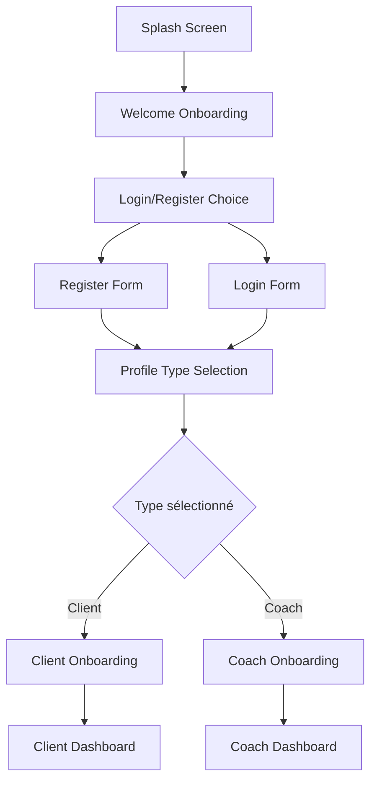

# User Flows V3 — MyCoach
*Parcours Coach vs Client détaillés*

## 🎯 Vue d'ensemble

**Deux parcours utilisateur distincts** avec des objectifs et des besoins différents :
- **👤 Client Flow** : Trouver un coach, réserver, s'entraîner, progresser
- **👨‍💼 Coach Flow** : Gérer ses clients, créer du contenu, développer son business

---

## 🚀 Onboarding Commun

### Flow Principal


### Étapes Détaillées

#### 1. Welcome & Auth (3-4 écrans)
```
01. Splash Screen (2s auto-advance)
    ↓
02. Welcome Onboarding (3 slides swipe)
    - Slide 1: "Trouvez votre coach idéal"
    - Slide 2: "Programmes personnalisés"  
    - Slide 3: "Progressez ensemble"
    [Skip] [Suivant] [S'inscrire]
    ↓
03. Register/Login Choice
    [S'inscrire] [Se connecter] [Google] [Apple]
    ↓
04a. Register Form OU 04b. Login Form
```

#### 2. Profile Type Selection (1 écran)
```
"Quel est votre profil ?"

┌─────────────────┐    ┌─────────────────┐
│  💪 CLIENT      │    │  🎯 COACH       │
│                 │    │                 │
│  Je cherche     │    │  Je propose     │
│  un coach       │    │  mes services   │
│                 │    │                 │
│  [Continuer]    │    │  [Continuer]    │
└─────────────────┘    └─────────────────┘
```

---

## 👤 Client Flow — Parcours Complet

### A. Onboarding Client (5-7 écrans)

#### Flow Principal
```
Profile Type: Client
    ↓
Personal Info (nom, âge, photo)
    ↓
Fitness Goals (objectifs, niveau)
    ↓
Gym Selection (localisation)
    ↓
Questionnaire Santé (optionnel)
    ↓
Discovery Tutorial (skip possible)
    ↓
Client Dashboard
```

#### Écrans Détaillés

**05a. Personal Info**
```
"Parlons de vous"

📸 [Photo Profile] (optionnel)
📝 Prénom: [____]
📝 Nom: [____]
🎂 Date naissance: [DD/MM/YYYY]
📍 Ville: [____]

[< Retour] [Continuer >]
```

**05b. Fitness Goals**
```
"Quels sont vos objectifs ?"

🎯 Objectif principal:
   ☐ Perte de poids
   ☐ Prise de muscle  
   ☐ Endurance
   ☐ Bien-être général
   ☐ Réhabilitation

📈 Niveau actuel:
   ☐ Débutant
   ☐ Intermédiaire
   ☐ Avancé

[< Retour] [Continuer >]
```

**05c. Gym Selection**
```
"Où vous entraînez-vous ?"

🏢 Salle de sport:
   🔍 [Rechercher par nom/ville]
   
📍 Salles proches:
   ✓ Fitness Park Châtelet (0.5km)
   ✓ Basic-Fit République (0.8km)
   ✓ L'Orange Bleue (1.2km)
   + À domicile
   + En extérieur

[< Retour] [Continuer >]
```

### B. Dashboard Client — Hub Principal

#### Vue d'ensemble
```
┌─────────────────────────────────────┐
│  🏠 Dashboard Client                │
├─────────────────────────────────────┤
│  👋 Bonjour Marie !                 │
│  📅 Prochaine séance: Demain 18h    │
│                                     │
│  📊 [Mes Performances]              │
│  📅 [Planning]                      │
│  💬 [Messages]                      │
│  🏋️ [Programmes]                     │
│                                     │
│  🎯 Objectifs du mois:              │
│  ▓▓▓░░ 60% (12/20 séances)          │
└─────────────────────────────────────┘
```

### C. Booking Flow — Réserver une Séance

#### Flow Principal (6-8 étapes)
```
Dashboard > [Planning]
    ↓
Calendar View (séances + créneaux libres)
    ↓
Coach Search (filtres + recommandations)
    ↓
Coach Profile (avis, spécialités, tarifs)
    ↓
Session Booking (date/heure, type)
    ↓
Discovery Tunnel (nouveau coach uniquement)
    ↓
Payment Method
    ↓
Confirmation
```

#### Écrans Détaillés

**06. Calendar View**
```
"Planning de la semaine"

📅 Lun 15  Mar 16  Mer 17  Jeu 18  Ven 19
    ─────   ─────   ─────   ─────   ─────
     9h      ∅       ∅      ∅       ∅
    10h      ∅       ∅      🏋️      ∅
    11h      ∅       ∅      (Tom)   ∅
    ...     ...     ...    ...     ...
    18h     🏋️       ∅      ∅       ∅
           (Paul)

[+ Nouvelle séance]
```

**07. Coach Search**
```
"Trouver un coach"

🔍 [Recherche] 🔧 [Filtres]

Filtres actifs:
🏢 Fitness Park Châtelet
🎯 Perte de poids
⭐ 4.5+ étoiles

Recommandés pour vous:
┌─────────────────────┐
│ 👨 Paul Martin      │
│ ⭐ 4.8 (127 avis)   │
│ 🎯 Perte de poids   │
│ 💰 45€/séance       │
│ 📍 0.2km            │
│ [Voir profil]       │
└─────────────────────┘
```

**08. Coach Profile Public**
```
┌─────────────────────────────────────┐
│ 👨 Paul Martin                       │
│ ⭐ 4.8/5 (127 avis) 🏆 Top Coach    │
│ 📍 Fitness Park Châtelet            │
├─────────────────────────────────────┤
│ 🎯 Spécialités:                     │
│ • Perte de poids                    │
│ • Remise en forme                   │
│ • Coaching débutant                 │
│                                     │
│ 💰 Tarifs:                          │
│ • Séance 1h: 45€                    │
│ • Pack 10 séances: 400€ (-11%)     │
│                                     │
│ 📅 [Réserver] 💬 [Message]         │
└─────────────────────────────────────┘
```

### D. Workout Flow — Séance Guidée

#### Flow Principal
```
Program Selection
    ↓
Workout Start
    ↓
Exercise Loop:
  - Exercise Display
  - Timer/Sets Counter
  - Rest Period
  - Next Exercise
    ↓
Workout Summary
    ↓
Performance Recording
```

#### Écrans Détaillés

**24a. Exercise Screen**
```
"Séance: Prise de masse - Pectoraux"

Exercice 3/8
🏋️ Développé couché

📊 3 séries × 12 reps
🔥 Charge: 60kg

[📹 Voir la démo]

Série actuelle: 2/3
Reps effectuées: [8] [+] [-]

[⏸️ Pause] [✓ Série terminée]
```

**24b. Rest Timer**
```
"Repos entre séries"

⏰ 01:25

💪 Prochain exercice:
   Incliné haltères

💡 Conseil du coach:
   "Hydrate-toi bien entre 
   les séries"

[⏸️ Pause] [⏩ Passer]
```

### E. Performance Flow — Suivi Progrès

#### Flow Principal
```
Dashboard > [Performances]
    ↓
Performance Dashboard
    ↓
Add New Performance
    ↓
Activity Type Selection:
  - Running
  - Machine/Weights  
  - Free Training
  - Other Activity
    ↓
Data Input (specific to type)
    ↓
Save & Analysis
```

---

## 👨‍💼 Coach Flow — Parcours Business

### A. Onboarding Coach (6-8 écrans)

#### Flow Principal
```
Profile Type: Coach
    ↓
Professional Info
    ↓
Certifications Upload
    ↓
Specialties Selection
    ↓
Gym Partnerships
    ↓
Pricing Setup
    ↓
Banking Details (KYC)
    ↓
Profile Review
    ↓
Coach Dashboard
```

#### Écrans Détaillés

**05e. Professional Info**
```
"Votre profil professionnel"

📸 [Photo Professionnelle]
📝 Nom complet: [____]
🏢 Nom commercial: [____]
📱 Téléphone pro: [____]
📧 Email pro: [____]
📍 Zone d'activité: [____]

📄 Bio courte (300 chars):
[_________________________]
[_________________________]

[< Retour] [Continuer >]
```

**05f. Certifications**
```
"Vos certifications"

📜 Diplômes/Certifications:

[📷 Ajouter un certificat]

Exemples reconnus:
• BPJEPS Activités Gymniques
• CQP Animateur Fitness
• Crossfit Level 1
• NASM-CPT
• Autre certification

[< Retour] [Continuer >]
```

### B. Dashboard Coach — Hub Business

#### Vue d'ensemble
```
┌─────────────────────────────────────┐
│  🎯 Dashboard Coach                 │
├─────────────────────────────────────┤
│  👋 Salut Paul !                    │
│  📈 CA ce mois: 2,450€ (+12%)       │
│                                     │
│  📊 [Analytics]                     │
│  👥 [Mes Clients (23)]              │
│  📅 [Planning]                      │
│  🏋️ [Mes Programmes]                 │
│  💰 [Tarifs & Paiements]            │
│                                     │
│  📈 Cette semaine:                  │
│  • 18 séances planifiées           │
│  • 3 nouveaux clients              │
│  • 4.9⭐ satisfaction moyenne       │
└─────────────────────────────────────┘
```

### C. Client Management Flow

#### Flow Principal
```
Dashboard > [Mes Clients]
    ↓
Client List (filtres, recherche)
    ↓
Client Profile Detail
    ↓
Actions disponibles:
  - View Progress
  - Add Notes
  - Assign Program
  - Schedule Session
  - Send Message
  - Credit Management
```

#### Écrans Détaillés

**06. Client List**
```
"Mes Clients (23)"

🔍 [Recherche] 🔧 [Filtres]

📊 Actifs (18)    😴 Inactifs (5)

👤 Marie Dubois
   📅 Prochaine: Demain 18h
   📊 Progrès: 🔥🔥🔥
   💬 2 messages non lus
   [Voir le profil]

👤 Jean Martin  
   📅 Pas de séance prévue
   📊 Progrès: 🔥🔥
   ⚠️ Pas d'activité depuis 1 sem
   [Voir le profil]
```

**07. Client Profile Detail**
```
👤 Marie Dubois - Fiche Client

📊 Vue d'ensemble:
• Objectif: Perte de poids (-8kg)
• Progrès: -4.2kg en 6 semaines  
• Séances: 18/24 (pack en cours)
• Satisfaction: 5⭐

📈 [Voir les performances]
📝 [Notes privées (3)]
🏋️ [Programmes assignés (2)]
💬 [Historique messages]

Actions rapides:
[📅 Planifier séance] [💬 Message]
[🏋️ Nouveau programme] [📊 Rapport]
```

### D. Program Creation Flow

#### Flow Principal
```
Dashboard > [Mes Programmes]
    ↓
Program Library
    ↓
Create New Program
    ↓
Program Setup:
  - General Info
  - Target Audience
  - Duration/Frequency
    ↓
Workout Builder:
  - Add Exercises
  - Set Parameters
  - Rest Periods
  - Progressions
    ↓
Preview & Test
    ↓
Publish to Library
```

#### Écrans Détaillés

**13. Program Creation**
```
"Créer un programme"

📋 Informations générales:
Nom: [____________________]
Description: [_____________]
[_________________________]

🎯 Public cible:
☐ Débutant    ☐ Intermédiaire    ☐ Avancé
☐ Homme       ☐ Femme            ☐ Mixte

🎯 Objectifs:
☐ Perte de poids    ☐ Prise de muscle
☐ Endurance         ☐ Tonification

⏱️ Durée:
Semaines: [4▼]  Séances/sem: [3▼]

[< Retour] [Continuer >]
```

### E. Revenue Management Flow

#### Flow Principal
```
Dashboard > [Tarifs & Paiements]
    ↓
Pricing Overview
    ↓
Package Management:
  - Create Package
  - Edit Rates  
  - Special Offers
    ↓
Payment Settings
    ↓
Revenue Analytics
```

---

## 🔄 Flows Transversaux

### A. Communication Flow (Chat/Messages)

#### Structures communes
```
Messages List
    ↓
Conversation Thread
    ↓
Message Composer:
  - Text input
  - Quick replies
  - Voice message
  - Photo/Video
  - Program sharing
    ↓
Send & Delivery confirmation
```

### B. Notification Flow

#### Types de notifications
```
Push Notification
    ↓
Tap to open
    ↓
Relevant Screen:
  - Session reminder → Calendar
  - Message → Chat
  - Progress update → Performance  
  - Payment → Billing
```

### C. Search Flow Universal

#### Structure commune
```
Search Entry Point
    ↓
Search Input + Filters
    ↓
Results (unified format):
  - Coaches
  - Programs  
  - Exercises
  - Clients (coach only)
    ↓
Detail View
```

---

## 📊 Success Metrics par Flow

### Client Flow Metrics
- **Onboarding completion** : >85%
- **First booking** : <48h après onboarding
- **Session attendance** : >90% des réservations
- **Retention Month 1** : >70%

### Coach Flow Metrics  
- **Profile completion** : >95%
- **First client** : <2 semaines
- **Client satisfaction** : >4.5⭐ moyenne
- **Revenue growth** : +15% mensuel

### Cross-Flow Metrics
- **Message response** : <2h moyenne
- **Search to action** : <3 étapes
- **App session length** : 5-8 min moyenne
- **Error rate** : <2% par flow critique

---

## 🎨 Differentiation Visuelle

### Coach Flows (Dark UI)
- **Ambiance** : Professionnelle, analytique
- **Interactions** : Hover effects prononcés, glassmorphism
- **Données** : Graphiques avancés, tableaux denses

### Client Flows (Light UI)  
- **Ambiance** : Dynamique, motivante
- **Interactions** : Animations fluides, micro-interactions
- **Données** : Visualisations simples, gamification

### Cohérence
- **Navigation patterns** identiques
- **Core interactions** cohérentes  
- **Information architecture** parallèle
- **Accessibility standards** partagés