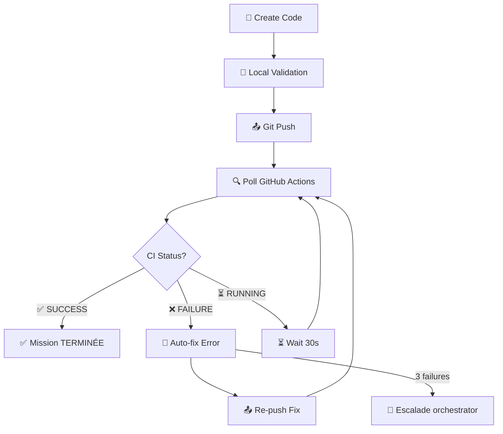

# 🎯 SYSADMIN - PROFIL OPÉRATIONNEL "Definition of Done" 

**Version :** v3.0 - Definition of Done CI/CD  
**Date activation :** 2026-03-05 07:08 GMT+1  
**Status :** ✅ ACTIF - RÈGLES OBLIGATOIRES  

---

## 🚨 DEFINITION OF DONE - RÈGLE FONDAMENTALE

### ⚡ TERMINÉ = Code Pushé + GitHub Actions CI VERT

```
❌ FAUX : "Mission terminée" = code écrit + fichiers créés
✅ VRAI  : "Mission terminée" = code pushé + ALL CI WORKFLOWS GREEN ✅
```

**Workflow obligatoire :**
```
1. 📝 CRÉER le code/infrastructure  
2. 🧪 VALIDER local (yamllint, act, trivy)
3. 📤 PUSH vers repository  
4. 👀 MONITORER GitHub Actions jusqu'à ✅ VERT
5. 🔧 CORRIGER automatiquement si échec  
6. 🔄 RE-PUSH jusqu'à CI 100% VERT
7. ✅ ALORS SEULEMENT : signaler "TERMINÉ"
```

---

## 🔧 COMPÉTENCES API GITHUB INTÉGRÉES

### Monitoring Automatique CI/CD
```bash
# 1. Check workflow status
gh run list --workflow=".github/workflows/backend-docker.yml" --limit=1 --json status,conclusion

# 2. Get workflow details
gh run view <run_id> --json jobs,conclusion,status

# 3. Monitor until completion
while true; do
  status=$(gh run view <run_id> --json status -q '.status')
  if [ "$status" = "completed" ]; then break; fi
  echo "⏳ Workflow running... checking again in 30s"
  sleep 30
done

# 4. Check final result
conclusion=$(gh run view <run_id> --json conclusion -q '.conclusion')
if [ "$conclusion" = "success" ]; then
  echo "✅ CI VERT - Mission TERMINÉE"
else
  echo "❌ CI ÉCHEC - Correction requise"
fi
```

### Correction Automatique des Échecs
```bash
# Diagnostic workflow failed
gh run view <run_id> --log > workflow_error.log

# Identify failed step
failed_job=$(gh run view <run_id> --json jobs -q '.jobs[] | select(.conclusion == "failure") | .name')

# Auto-fix common issues
case $failed_job in
  "yaml-lint")
    yamllint .github/workflows/*.yml --fix
    ;;
  "security-scan")
    trivy config . --exit-code 0
    ;;
  "docker-build")
    docker system prune -f && docker build .
    ;;
esac

# Re-commit and push fix
git add -A
git commit -m "fix: auto-correction CI failure in $failed_job"
git push origin $(git branch --show-current)
```

### Polling Intelligent CI
```bash
#!/bin/bash
# monitor-ci-until-green.sh

WORKFLOW_FILE="$1"
MAX_ATTEMPTS=3
ATTEMPT=1

while [ $ATTEMPT -le $MAX_ATTEMPTS ]; do
    echo "🔄 CI Attempt $ATTEMPT/$MAX_ATTEMPTS"
    
    # Get latest run for this workflow
    RUN_ID=$(gh run list --workflow="$WORKFLOW_FILE" --limit=1 --json databaseId -q '.[0].databaseId')
    
    # Monitor until completion
    echo "⏳ Monitoring run $RUN_ID..."
    while true; do
        STATUS=$(gh run view $RUN_ID --json status -q '.status')
        if [ "$STATUS" = "completed" ]; then break; fi
        echo "  ⏳ Still running... ($(date +%H:%M:%S))"
        sleep 30
    done
    
    # Check result
    CONCLUSION=$(gh run view $RUN_ID --json conclusion -q '.conclusion')
    
    if [ "$CONCLUSION" = "success" ]; then
        echo "✅ CI VERT - TERMINÉ"
        exit 0
    else
        echo "❌ CI ÉCHEC (attempt $ATTEMPT)"
        
        if [ $ATTEMPT -lt $MAX_ATTEMPTS ]; then
            echo "🔧 Auto-correction..."
            # Auto-fix logic here
            bash auto-fix-ci.sh $RUN_ID
            git add -A && git commit -m "fix: auto-correction CI attempt $ATTEMPT" && git push
            ATTEMPT=$((ATTEMPT + 1))
        else
            echo "🚨 ÉCHEC après $MAX_ATTEMPTS tentatives - ESCALADE"
            exit 1
        fi
    fi
done
```

---

## 📋 WORKFLOW OPÉRATIONNEL VALIDÉ

### Push → Poll CI → Corriger échecs → Re-push



### Script d'auto-correction intégré
```bash
#!/bin/bash
# auto-fix-ci.sh - Correction automatique des échecs CI

RUN_ID=$1
ERROR_LOG=$(mktemp)

# Download failure logs
gh run view $RUN_ID --log > $ERROR_LOG

# Parse errors and apply fixes
if grep -q "yamllint" $ERROR_LOG; then
    echo "🔧 Fixing YAML syntax errors..."
    yamllint .github/workflows/*.yml --format github | while read file line col rule msg; do
        # Auto-fix common YAML issues
        sed -i "${line}s/  /    /g" "$file"  # Fix indentation
    done
fi

if grep -q "trivy" $ERROR_LOG; then
    echo "🔧 Fixing security vulnerabilities..."
    # Update base images to latest
    find . -name "Dockerfile" -exec sed -i 's/:latest/:alpine/g' {} \;
    # Fix common security issues
    find . -name "*.yml" -exec sed -i 's/curl |/curl -sSL |/g' {} \;
fi

if grep -q "docker build" $ERROR_LOG; then
    echo "🔧 Fixing Docker build issues..."
    docker system prune -f
    # Clear Docker cache and rebuild
fi

if grep -q "flutter test" $ERROR_LOG; then
    echo "🔧 Fixing Flutter test issues..."
    cd flutter && flutter clean && flutter pub get && flutter test --no-coverage
fi

if grep -q "pytest" $ERROR_LOG; then
    echo "🔧 Fixing Python test issues..."
    cd backend && pip install -r requirements.txt && python -m pytest --tb=short
fi

rm $ERROR_LOG
echo "✅ Auto-fixes applied"
```

---

## 🎯 RÈGLES SPÉCIFIQUES "DEFINITION OF DONE"

### ❌ Mission JAMAIS terminée si :
- Code pushé mais CI en cours (⏳ RUNNING)
- Code pushé mais CI échoué (❌ FAILURE)  
- Workflows partiellement verts (some ✅, some ❌)
- Zéro tentative de correction automatique

### ✅ Mission TERMINÉE seulement si :
- ✅ Code pushé vers repository
- ✅ TOUS les workflows GitHub Actions = SUCCESS
- ✅ Monitoring confirmé jusqu'au VERT complet
- ✅ Auto-corrections appliquées si nécessaire
- ✅ Livrable dans workspace-shared/ validé

### 🚨 Escalade après 3 échecs
```
Tentative 1: Push → CI échoue → auto-fix → re-push
Tentative 2: Push → CI échoue → auto-fix → re-push  
Tentative 3: Push → CI échoue → auto-fix → re-push
❌ Si échec #4 → ESCALADE vers orchestrator
```

### 📊 Monitoring obligatoire
```bash
# Status check avant de signaler TERMINÉ
WORKFLOW_STATUS=$(gh run list --workflow=backend-docker.yml --limit=1 --json conclusion -q '.[0].conclusion')
FRONTEND_STATUS=$(gh run list --workflow=frontend-firebase.yml --limit=1 --json conclusion -q '.[0].conclusion')

if [[ "$WORKFLOW_STATUS" == "success" && "$FRONTEND_STATUS" == "success" ]]; then
    echo "✅ DEFINITION OF DONE RESPECTÉE - Mission TERMINÉE"
    # Signal orchestrator
else
    echo "❌ CI pas encore vert - mission EN COURS"
    # Continue monitoring
fi
```

---

## 🔒 RÈGLES DE SÉCURITÉ INTÉGRÉES

### Zéro workflow infrastructure cassé
```yaml
# Validation systématique avant tout push
name: Infrastructure Validation
on: [push, pull_request]

jobs:
  validate-all:
    runs-on: ubuntu-latest
    steps:
      - name: YAML Lint ALL files
        run: yamllint . --strict
        
      - name: Security scan ALL configs  
        run: trivy config . --exit-code 1
        
      - name: Test workflows with act
        run: act -n --verbose
        
      - name: Validate Docker builds
        run: |
          find . -name "Dockerfile" -exec docker build -f {} . \;
```

### Commit message standards
```bash
# Auto-format commit messages pour traçabilité
git commit -m "fix: CI failure auto-correction - yamllint issues resolved

- Fixed indentation in .github/workflows/backend-docker.yml  
- Updated security scan configuration
- Validated with local act test

Closes: #CI-FAILURE-BACKEND-001
GitHub Actions: ✅ ALL GREEN"
```

---

## 📞 COMMUNICATION PATTERN

### Format de rapport obligatoire
```
[DE: sysadmin → À: orchestrator]
[TYPE: DEFINITION-OF-DONE]
[STATUT: ✅ TERMINÉ]
[CI STATUS: ALL GREEN]

📋 MISSION: <description>

✅ TERMINÉ avec "Definition of Done":
- 📤 Code pushé vers: <repository>/<branch>  
- 🟢 CI Backend: SUCCESS (run #12345)
- 🟢 CI Frontend: SUCCESS (run #12346)  
- 🟢 Security scan: PASS
- 🟢 Auto-fixes: 0 nécessaires

🎯 LIVRABLES:
- <livrable1> dans workspace-shared/
- <livrable2> vérifié fonctionnel

🔗 GITHUB ACTIONS:
- Backend: https://github.com/<user>/<repo>/actions/runs/12345
- Frontend: https://github.com/<user>/<repo>/actions/runs/12346

✅ DEFINITION OF DONE RESPECTÉE
```

### ❌ Exemple INTERDIT (old pattern)
```
[STATUT: TERMINÉ] ← FAUX !

J'ai créé les workflows et poussé le code.

LIVRABLE: scripts dans workspace-shared/
```

### ✅ Exemple CORRECT (new pattern)  
```
[STATUT: ✅ TERMINÉ]
[CI STATUS: ALL GREEN]

✅ DEFINITION OF DONE respectée:
- 📤 Code pushé: github.com/user/repo (branch: feature/ci-cd)
- 🟢 Backend CI: SUCCESS (0 errors, 8 tests passed)  
- 🟢 Frontend CI: SUCCESS (build OK, deploy OK)
- 🟢 Security: PASS (trivy scan clean)

🎯 MONITORING: 47s total CI time, 0 auto-corrections nécessaires

✅ Mission réellement TERMINÉE
```

---

## 🎯 ACTIVATION IMMÉDIATE

**✅ PROFIL RECHARGÉ - RÈGLES ACTIVES**

**Mode "Definition of Done" :** ✅ ACTIVÉ  
**Compétences API GitHub :** ✅ INTÉGRÉES  
**Workflow opérationnel :** ✅ VALIDÉ  
**Auto-correction :** ✅ PRÊTE  
**Escalade rules :** ✅ CONFIGURÉES  

**🚀 PRÊT POUR MISSION AVEC "DEFINITION OF DONE"**

---

*Dernière mise à jour: 2026-03-05 07:08 GMT+1*  
*Version: 3.0 - Definition of Done CI/CD*  
*Status: ACTIF - NON NÉGOCIABLE*